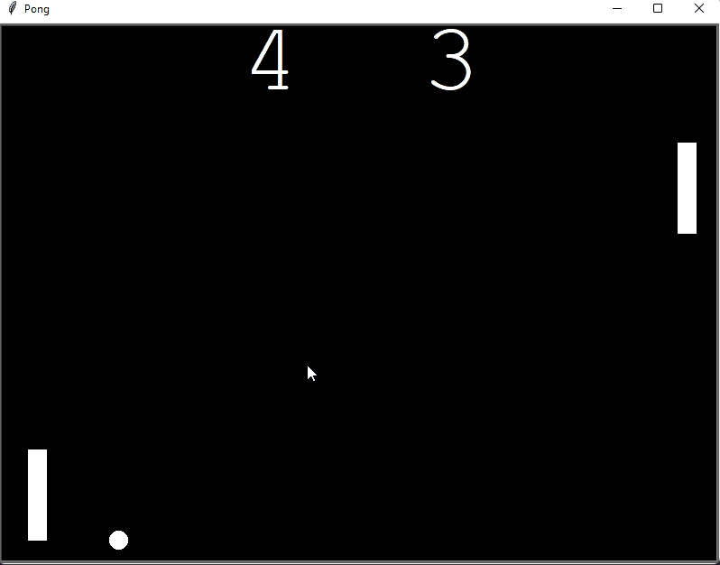

# Python Pong Game
Python Pong game using the turtle module. Developed as a learning project.

</img>

main.py:
--------
* Creates the game objects, game window and runs the game loop. 
* The game run continuously until you exit the window. 

paddle.py:
-------
* An extention of the Turtle class for creating and controlling the paddles position.

ball.py:
-------
* An extention of the Turtle class for creating and controlling the ball. Detects collisions with the paddles and walls, reversing the trajectory.

scoreboard.py:
-------
* An extention of the Turtle class for screen writing scores. 
